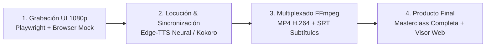

# 🎥 Videotutoriales, Guiones de Producción y Masterclass — NutriAgenda

Bienvenido al centro de recursos audiovisuales y guiones pedagógicos de **OpenFoodFacts & NutriAgenda**. Aquí se recopilan los materiales didácticos, las grabaciones en alta definición (1080p), subtítulos y recursos listos para procesar con **Gemini Multimodal** o **Google NotebookLM**.

---

## 🧭 Flujo Automatizado de Producción de Contenidos



> 📺 **[🌐 Abrir Visor Web Interactivo](./tutorials/visor_masterclass.html)** • **[🎥 Ver en YouTube](https://youtu.be/6JnIzN3MNX4)**  
> 📹 **[🎬 Descargar Vídeo Unificado MP4](./tutorials/masterclass_completa_nutriagenda.mp4)** • **[💬 Subtítulos SRT](./tutorials/masterclass_completa_subtitulos.srt)** • **[📝 Ficha de YouTube](./tutorials/YOUTUBE_DESCRIPCION.md)**

---

## 📚 Índice de los 7 Capítulos de la Masterclass

| Cap. | Título y Enfoque | Resumen Pedagógico | Entregables Generados |
| :---: | :--- | :--- | :--- |
| **01** | **Introducción & Filosofía Offline-First** | Soberanía sobre los datos de salud y almacenamiento local con Dexie / IndexedDB sin servidores intermedios. | • `capitulo_1_masterclass.mp4`<br>• `capitulo_1_subtitulos.srt` |
| **02** | **Supermercado Inteligente & Alertas de Aditivos** | Escaneo en tienda, detección visual de aditivos nocivos (E250 nitrito sódico), propuesta de alternativas sanas y presupuesto. | • `capitulo_2_masterclass.mp4`<br>• `capitulo_2_subtitulos.srt` |
| **03** | **De la Cesta a la Cocina: Checkout y Despensa** | Traspaso automático de la compra al inventario del hogar y trazabilidad de existencias en tiempo real. | • `capitulo_3_masterclass.mp4`<br>• `capitulo_3_subtitulos.srt` |
| **04** | **Editor de Recetas & Ficha de Ingredientes** | Creación de platos, cabecera con menú desplegable `⋮`, desglose de calorías, macronutrientes y ficha profunda con micronutrientes. | • `capitulo_4_masterclass.mp4`<br>• `capitulo_4_subtitulos.srt` |
| **05** | **NutriAgenda & Registro Fotográfico** | Planificación en la agenda semanal, descuento automático de stock de despensa y diario fotográfico. | • `capitulo_5_masterclass.mp4`<br>• `capitulo_5_subtitulos.srt` |
| **06** | **Dashboard de Salud & Explorador BEDCA / OFF** | Métricas de variedad semanal, explorador de base de datos con pestaña de Alimentos Básicos (BEDCA) y OpenFoodFacts. | • `capitulo_6_masterclass.mp4`<br>• `capitulo_6_subtitulos.srt` |
| **07** | **Alimentos Básicos BEDCA, Pack Mediterráneo & Mealie** | Catálogo de 980 alimentos naturales sin procesar, pack de 12 recetas mediterráneas en 1 clic e integración con servidores Mealie. | • `capitulo_7_masterclass.mp4`<br>• `capitulo_7_subtitulos.srt` |

---

## 🤖 Prompts para Creación de Contenido con IA

### Prompt para Google Gemini Studio (Análisis y Guiones de Apoyo)
```markdown
Actúa como un divulgador experto en nutrición comunitaria, soberanía tecnológica y software de código abierto.
Analiza la siguiente transcripción de la Masterclass de NutriAgenda y genera:
1. Una infografía resumen con los 4 pilares: Escaneo → Despensa → Receta → Diario.
2. Un hilo divulgativo para redes sociales explicando por qué evitar el aditivo E250 (nitrito sódico) y cómo NutriAgenda ayuda en el supermercado.
3. Una tabla nutricional comparativa de las recetas elaboradas.
```

### Prompt para Google NotebookLM (Audio Podcast / Deep Dive)
```markdown
Genera una conversación amena y educativa entre dos expertos debatiendo sobre las ventajas del enfoque "Offline-First" en aplicaciones de salud personal y cómo la combinación con OpenFoodFacts permite a cualquier familia optimizar su presupuesto y su salud sin ceder sus datos a grandes corporaciones.
```
