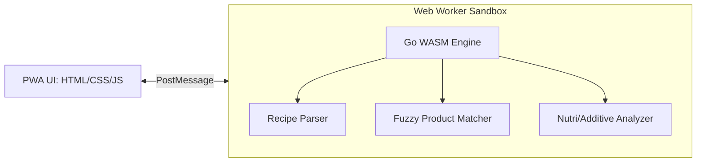

Listed directory buscatureceta
Listed directory src
Listed directory js
Listed directory modules
Listed directory nutrition
Listed directory recipes
Listed directory adapters
Viewed analis_e.md:1-100
Searched for "parse"

En una aplicación como **Buscatureceta** (que funciona como PWA offline-first con catálogo local, análisis nutricional y gestión de aditivos), migrar partes de lógica analítica y computacional a **Golang + WebAssembly (WASM)** tiene mucho sentido técnico.

Aquí tienes un desglose de las partes donde **Go + WASM** aportaría más valor, especialmente enfocado en el **análisis de recetas y productos**, y cómo plantear la arquitectura:

---

### 1. Dónde tiene más sentido (Casos de uso clave)

#### A. Motor de Parsing y Extracción de Ingredientes (NLP / Gramática)
* **El problema en JS:** Parsear texto no estructurado de recetas ("2 pechugas de pollo medianas cortadas en dados", "una pizca de sal", "250 ml de leche desnatada") requiere tokenización, extracción de cantidades/fracciones, normalización de unidades de medida (sistema métrico, imperial, medidas culinarias) y limpieza de modificadores ("picado", "al gusto").
* **Por qué Go:** Go es idóneo para crear un analizador léxico/sintáctico (lex/parser o autómata finito) robusto, fuertemente tipado y ultrarrápido. Permite estructurar cualquier texto libre en:
  ```go
  type ParsedIngredient struct {
      Raw         string  `json:"raw"`
      Name        string  `json:"name"`        // "pollo"
      Quantity    float64 `json:"quantity"`    // 2.0
      Unit        string  `json:"unit"`        // "unidad"
      NormalizedG float64 `json:"normalized_g"`// 300.0 (peso estimado)
  }
  ```

#### B. Motor de Búsqueda Fuzzy & Matching de Ingredientes con Productos
* **El problema en JS:** Una vez extraído el ingrediente ("leche entera"), necesitas encontrar el producto o valor nutricional correspondiente entre miles de productos (por ejemplo de OpenFoodFacts / `spain_products`).
* **Por qué Go:** Puedes implementar en Go un **índice en memoria** con algoritmos como:
  * **Trigram matching / Levenshtein Distance** o **BM25**.
  * **Fonética en español** (Soundex/Metaphone adaptado a castellano para erratas).
  * En WASM sobre un Web Worker, Go puede evaluar miles de productos en milisegundos con cero lag en la UI.

#### C. Análisis de Aditivos, Alérgenos y Grado de Procesamiento (NOVA / Nutri-Score)
* **El problema:** Analizar la lista de ingredientes de recetas o productos buscando códigos `E-xxx`, nombres sinónimos (ej: *glutamato monosódico*, *tartrazina*), niveles de toxicidad/riesgo (como lo que hace [analis_e.md](file:///home/jose/workspace/josejuanmontiel/buscatureceta/analis_e.md)) y clasificar el grado de ultraprocesamiento (NOVA 1 a 4).
* **Por qué Go:** Un motor de reglas en Go (`rule-engine`) estructurado por árboles de decisión evalúa aditivos cruzados, interacciones y niveles de riesgo de forma determinista y con tests unitarios exhaustivos.

#### D. Descompresión y Procesamiento en Streaming del Dataset (`spain_products.tsv.zz`)
* **El problema:** Manejar archivos comprimidos (`.zz` / `.tsv` de >20MB) en el navegador consume CPU y memoria si se hace con librerías JS pesadas.
* **Por qué Go:** El paquete estándar `compress/flate` / `compress/gzip` junto con `bufio.Scanner` en Go procesa el flujo en streaming con un consumo de memoria mínimo y mucha mayor velocidad que Pako/PapaParse en JS.

---

### 2. Arquitectura Recomendada: "Go as an Engine Worker"

Para una PWA, la mejor estrategia no suele ser reescribir toda la UI en Go (frameworks como Vugu o Vecty aún penalizan el tamaño del bundle y la fluidez del DOM), sino el patrón **Core Engine**:



* **Cero bloqueo de UI:** La UI se mantiene ligera (animaciones a 60fps).
* **Portabilidad total:** El paquete de análisis de Go se puede ejecutar tanto en WASM (en el cliente) como en CLI (scripts de mantenimiento) o en un backend API si algún día se necesitara, con exactamente el mismo código fuente.

---

### 3. Recomendación de Tooling para Go + WASM

1. **Compilar con [TinyGo](https://tinygo.org/):**
   * El compilador estándar `go build -o main.wasm` genera binarios de **~2MB a 3MB** (incluso gzippeado queda en ~500-800KB).
   * **TinyGo** genera binarios WASM de **~50KB - 300KB**, perfecto para cargar instantáneamente en una PWA móvil.
2. **Uso de tipos / serialización:**
   * Pasar JSON o buffers binarios (`syscall/js` o arrays tipados `Uint8Array`) entre el Web Worker JS y el módulo Go.

---

### Resumen

Si quieres empezar por la parte con mayor retorno de inversión:
1. **Parser de ingredientes de recetas:** Convertir texto libre a cantidades, unidades e ingredientes normalizados.
2. **Motor de análisis de aditivos y salud:** Evaluar riesgos E-xxx, alergenos y cálculo de métricas nutricionales en un paquete Go aislado.